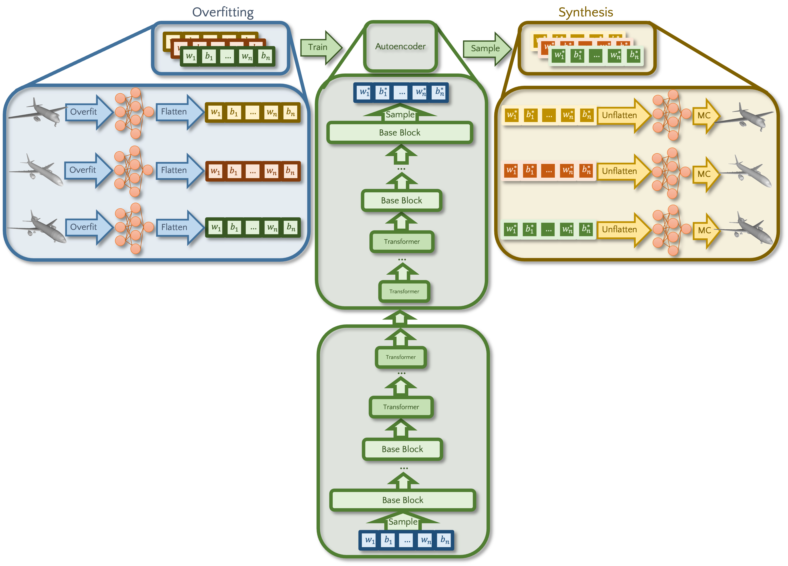

# VAE meets HyperDiffusion

This repository is an extention of the official HyperDiffusion repository.
[](https://arxiv.org/abs/2303.17015)

The code can be found in src. Additionally to the Hyperdiffusion code the repository contains three Autoencoder (src/unet, src/vae, src/ldm_autoencoder).
The basic pipeline remains similar:



## Dependencies

* Tested on Ubuntu 20.04
* Python 3.7
* PyTorch 1.13.0
* CUDA 11.7
* Weights & Biases (We heavily rely on it for visualization and monitoring)


For full list please see [hyperdiffusion_env.yaml file](/hyperdiffusion_env.yaml)

## Data
All the data needed to train and evaluate HyperDiffusion is in [this Drive folder](https://drive.google.com/drive/folders/1CuNVa92jcKlGBiHEuCQK2-juAB6Q6QPx?usp=sharing).
There are three main folders there:
- **Checkpoints** contains trained diffusion model for each category, you'll need them for [evaluation](#evaluation)
- **MLP Weights** involves already overfitted MLP weights.
- **Point Clouds (2048)** has the set of 2048 points sampled from meshes to be used for metric calculation and baseline training.  

## Get Started
We have a .yaml file that you can create a conda environment from. Simply run,

```commandline
conda env create --file hyperdiffusion_env.yaml
conda activate hyper-diffusion
```

_We specify our runtime parameters using .yaml files which are inside configs folder. There are different yaml files for each category and task._

Then, download **MLP Weights** from [our Drive](https://drive.google.com/drive/folders/1CuNVa92jcKlGBiHEuCQK2-juAB6Q6QPx?usp=sharing) and put it into **mlp_weights** folder. Config files assume that weights are in that folder.

For 3D, download **Point Clouds (2048)** folder from [Drive](https://drive.google.com/drive/folders/1CuNVa92jcKlGBiHEuCQK2-juAB6Q6QPx?usp=sharing) and save its content to **data** folder. Eventually, **data** folder should look like this:
```
data
|-- 02691156
|-- 02691156_2048_pc
|-- 02958343
|-- 02958343_2048_pc
|-- 03001627
|-- 03001627_2048_pc
|-- animals
```
_Note: Category id to name conversion is as follows: 02691156 -> airplane, 02958343 -> car, 03001627 -> chair_
### Evaluation
Download **Checkpoints** folder from [Drive](https://drive.google.com/drive/folders/1CuNVa92jcKlGBiHEuCQK2-juAB6Q6QPx?usp=sharing). Assign the path of that checkpoint to the `best_model_save_path` parameter.

to start evaluating, airplane category:
```commandline
python main.py --config-name=train_plane mode=test best_model_save_path=<path/to/checkpoint>
```
(_checkpoints coming soon!_) car category:
```commandline
python main.py --config-name=train_car mode=test best_model_save_path=<path/to/checkpoint>
```
(_checkpoints coming soon!_) chair category (we have special operations for chair, see our Supplementary Material for details):
```commandline
python main.py --config-name=train_chair mode=test best_model_save_path=<path/to/checkpoint> test_sample_mult=2 dedup=True
```
(_checkpoints coming soon_) 4D animals category:
```commandline
python main.py --config-name=train_4d_animals mode=test best_model_save_path=<path/to/checkpoint>
```
### Training
To start training, airplane category:
```commandline
python main.py --config-name=train_plane
```
(_MLP weights coming soon_) car category:
```commandline
python main.py --config-name=train_car
```
(_MLP weights coming soon_) chair category:
```commandline
python main.py --config-name=train_chair
```
(_MLP weights coming soon_) 4D animals category:
```commandline
python main.py --config-name=train_4d_animals
```

We are using [hydra](https://hydra.cc/), you can either specify parameters from corresponding yaml file or directly modify
them from terminal. For instance, to change the number of epochs:

```commandline
python main.py --config-name=train_plane epochs=1
```
### Overfitting
We already provide overfitted shapes but if you want to do it yourself make sure that you put downloaded [ShapeNet](https://shapenet.org/) shapes (we applied [ManifoldPlus](https://github.com/hjwdzh/ManifoldPlus) pre-processing) into **data** folder.
After that, we first create point clouds and then start overfitting on those point clouds; following lines do exactly that:
```commandline
python siren/experiment_scripts/train_sdf.py --config-name=overfit_plane strategy=save_pc
python siren/experiment_scripts/train_sdf.py --config-name=overfit_plane
```

## Code Map
### Directories
- **configs**: Containing training and overfitting configs.
- **data**: Downloaded point cloud files including train-val-test splits go here (see [Get Started](#get-started)) 
- **diffusion**: Contains all the diffusion logic. Borrowed from [OpenAI](https://github.com/openai/guided-diffusion) .
- **ldm**: Latent diffusion codebase for Voxel baseline. Borrowed from [official LDM repo](https://github.com/CompVis/latent-diffusion).
- **mlp_weights**: Includes overfitted MLP weights should be downloaded to here (see [Get Started](#get-started)).
- **siren**: Modified [SIREN](https://github.com/vsitzmann/siren) codebase. Includes shape overfitting logic.
- **static**: Images for README file.
- **Pointnet_Pointnet2_pytorch**: Includes Pointnet2 definition and weights for 3D FID calculation.
### Generated Directories
- **lightning_checkpoints**: This will be created once you start training for the first time. It will include checkpoints of the diffusion model, the sub-folder names will be the unique name assigned by the Weights & Biases in addition to timestamp.
- **outputs**: Hydra creates this folder to store the configs but we mainly send our outputs to Weights & Biases, so, it's not that special.
- **orig_meshes**: Here we put generated weights as .pth and sometimes generated meshes.
- **wandb**: Weights & Biases will create this folder to store outputs before sending them to server.
### Files
**Utils**
- **augment.py**: Including some augmentation methods, though we don't use them in the main paper.
- **dataset.py**: `WeightDataset` and `VoxelDataset` definitions which are `torch.Dataset` descendants. Former one is related to our HyperDiffusion method, while the latter one is for Voxel baseline.
- **hd_utils.py**: Many utility methods ranging from rendering to flattening MLP weights.

**Evaluation**

- **torchmetrics_fid.py**: Modified torchmetrics fid implementation to calculate 3D-FID.
- **evaluation_metrics_3d.py**: Methods to calculate MMD, COV and 1-NN from [DPC](https://github.com/luost26/diffusion-point-cloud). Both for 3D and 4D.

**Entry Point**
- **hyperdiffusion_env.yaml**: Conda environment file (see [Get Started](#get-started) section).
- **main.py**: Entry point of our codebase.


**Models**
 
- **mlp_models.py**: Definition of ReLU MLPs with positional encoding.
- **transformer.py**: GPT definition from [G.pt paper](https://github.com/wpeebles/G.pt).
- **embedder.py**: Positional encoding definition.
- **hyperdiffusion.py**: Definition of our method, it includes training, testing and validation logics in the form of a Pytorch Lightning module.
